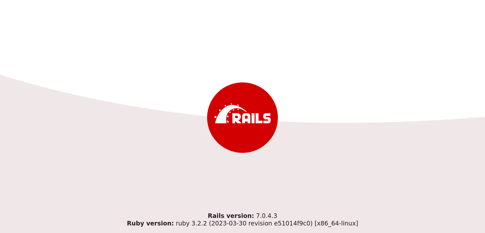

# API starter template.



This README would normally document whatever steps are necessary to get the
application up and running.

Things you may want to cover:

## Ruby version

```
Ruby 3.2.2
```

# System dependencies

## Core dependencies

- Ruby 3.2.2
- Rails "~> 7.0.4", ">= 7.0.4.3"
- Postgresql "~> 1.1"
- Rspec '~> 6.0.0'

# Configuration

- Coming soon ...

# Database

### Database creation

```
rails db:create
```

### Database migration

```
rails db:migrate
```

# How to run the test suite

## Rspec is the default installed testing framework for the API.

Default: Run all spec files (i.e., those matching spec/\*_/_\_spec.rb)

```
bundle exec rspec
```

Run all spec files in a single directory (recursively)

```
bundle exec rspec spec/models
```

Run a single spec file

```
bundle exec rspec spec/controllers/articles_controller_spec.rb
```

See all options for running spec

```
bundle exec rspec --help
```

## RSpec DSL Basics (or, how do I write a spec?)

```
RSpec.describe 'Article' do        #
  context 'before publication' do  # (almost) plain English
    it 'cannot have comments' do   #
      expect { Article.create.comments.create! }.to raise_error(ActiveRecord::RecordInvalid)  # test code
    end
  end
end
```

# Services (job queues, cache servers, search engines, etc.)

- Coming Soon ...

# Deployment instructions

- Coming Soon ...
